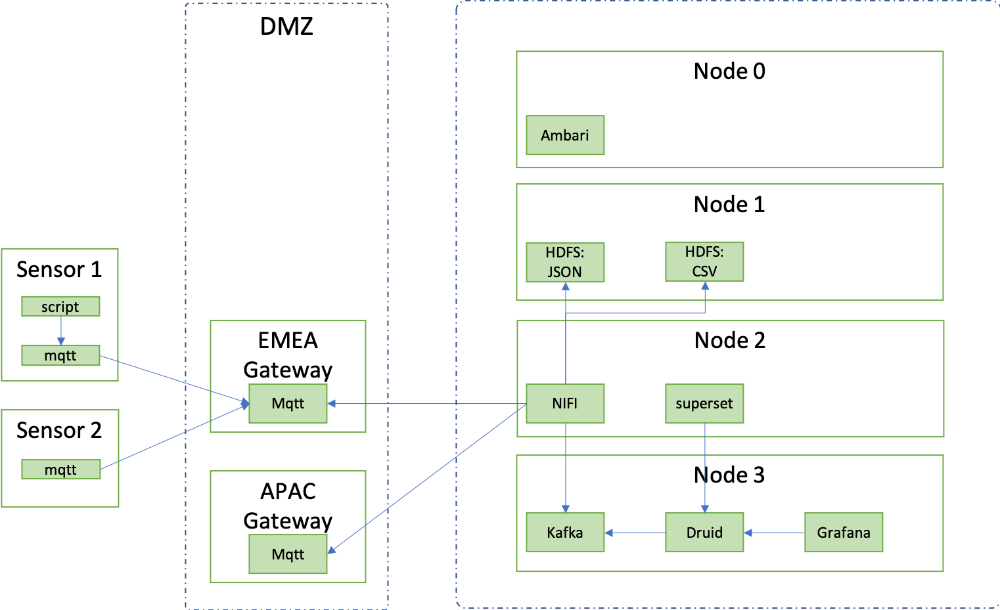
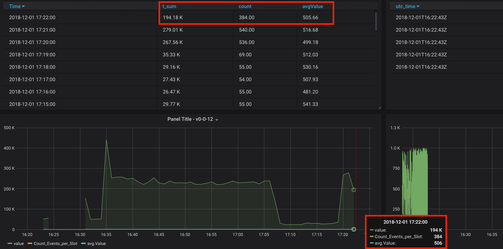
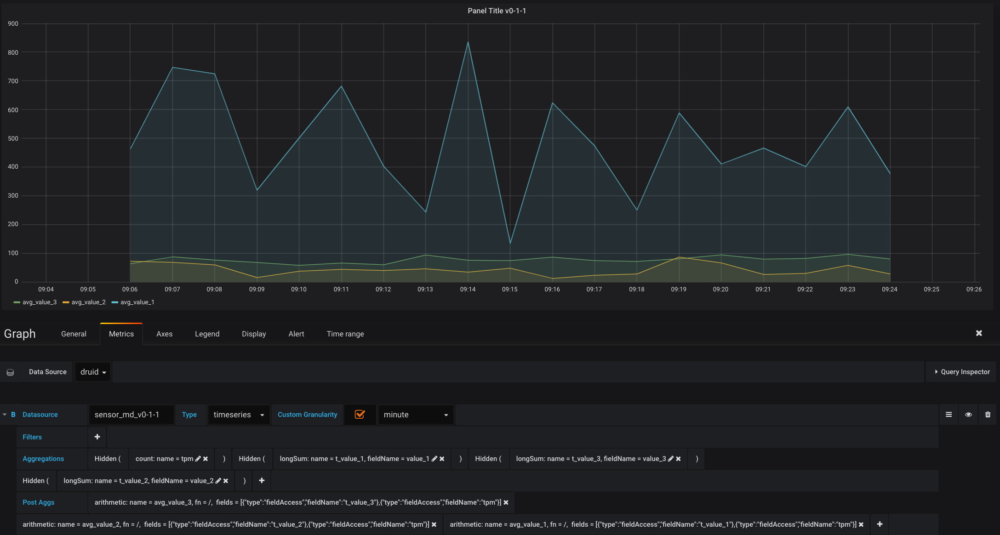
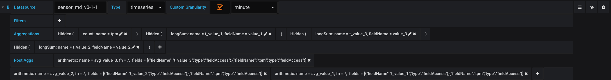

# IoT Show Case

**Vison**  
e2e IoT Show Case which visualizes the data (near) real-time in grafana

**The idea is:**  
1.) have multiple IoT agents / sensors which using a local mqtt server instance to avoid the risk of loss of data  
2.) mqtt server in the sensor forward to messages to regional mqtt gateway  e.g. 'EMEA Gateway'  
3.) NIFI collects the messages form the regional gateway and pushing into a Kafka Topic 'sensor_md' and stores the messages in JSON & CSV format into HDFS  
4.) Druid runs the Kafka-Index-Service with a supervison-spec listening on the Kafka Topic 'sensor_md' - Supewrvision spec corresponding to the JSON format of the sensor messages  
5.) The Druid-plugin in Grafana is used for the visualisation 

#Setup  
Is running on Virtualbox and is based on the latest Hortonworks release of:  
1.) Ambari  
2.) HDP  
3.) HDF 

**Kafka:**  
cd /usr/hdp/current/kafka-broker/  
./bin/kafka-topics.sh --create --zookeeper druid.hdp.md:2181 --replication-factor 1 --partitions 1 --topic sensor_md  
./bin/kafka-topics.sh --list --zookeeper druid.hdp.md:2181  
./bin/kafka-console-consumer.sh --bootstrap-server druid.hdp.md:6667 --topic sensor_md

**Druid - supervisior (Kafka-Index-Service):**

>FYI: *The Kafka Ingestion is still in Technical Preview as of today, so It doesn’t come bundled as part of the platform. As such, some minor configuration changes will need to be applied.  
In Ambari, navigate to the druid service and click on the configs tab. Now, using the filter, search for “druid.extensions.loadList”.  
For this parameter, enter “druid-kafka-indexing-service” to the list. This parameter essentially tells Druid to load these extensions on startup on the cluster.*

add *supervisor* spec:  
cd /usr/hdp/current/druid-broker/  
mkdir supervisor
cd  supervisor
copy file IoT-kafka-supervisor_v0-1-1.json  into the new directory

start *supervisor* task:  
curl -XPOST -H'Content-Type: application/json' -d @Iot-supervisor-v0-1-1.json http://druid.hdp.md:8090/druid/indexer/v1/supervisor

**NIFI**  
start NIFI UI vi quicklink in ambari  
upload NIFI_mqtt-kafka-mysql.xml as a new template  
drop new templete into a empty flow   

**IoT Sensor:**  
start data-generator in the local pc:  
watch -n60 python3 mqtt_loop.py

*Data example*  
{"host": "sensor-4711", "unix_time": 1543904051, "utc_time": "2018-12-04T07:14:11.928913", "value_1": 33, "value_2": 34, "value_3": 60}

**Grafana:**  
Download and install latest grafana local & Install druid-plugin:  
grafana-cli plugins install abhisant-druid-datasource

start grafana server:  
grafana-server --config=/usr/local/etc/grafana/grafana.ini --homepath /usr/local/share/grafana cfg:default.paths.logs=/usr/local/var/log/grafana cfg:default.paths.data=/usr/local/var/lib/grafana cfg:default.paths.plugins=/usr/local/var/lib/grafana/plugins
 

**Configure Grafana dashboard:**
Honestly, the druid editor is a diva and it needs some time to get used to it.... 
It is important to save every part of the query with 'add tag'.  
*Limitation:* with the current grafana-druid plugin (v.0.0.5) the query is at least 60 seconds. To get around this, you have to calculate the sum of the values across all events and divide them by the number of events to get an average. mysql (graph on the left side) is able to show all events individual.  

with 3 individual *sensor values* per message on one dashboard:     

Druid-Plugin editor details:

relevant part of the exported grafana spec:

      "targets": [
        {
          "aggregators": [
            {
              "hidden": true,
              "name": "tpm",
              "type": "count"
            },
            {
              "fieldName": "value_1",
              "hidden": true,
              "name": "t_value_1",
              "type": "longSum"
            },
            {
              "fieldName": "value_3",
              "hidden": true,
              "name": "t_value_3",
              "type": "longSum"
            },
            {
              "fieldName": "value_2",
              "hidden": true,
              "name": "t_value_2",
              "type": "longSum"
            }
          ],
          "currentAggregator": {
            "type": "count"
          },
          "currentFilter": {
            "type": "selector"
          },
          "currentPostAggregator": {
            "fn": "+",
            "type": "arithmetic"
          },
          "currentSelect": {
            "dimension": "",
            "metric": ""
          },
          "customGranularity": "minute",
          "druidDS": "sensor_md_v0-1-1",
          "errors": {},
          "filters": [],
          "hide": false,
          "limit": 5,
          "postAggregators": [
            {
              "fields": [
                {
                  "fieldName": "t_value_3",
                  "type": "fieldAccess"
                },
                {
                  "fieldName": "tpm",
                  "type": "fieldAccess"
                }
              ],
              "fn": "/",
              "name": "avg_value_3",
              "type": "arithmetic"
            },
            {
              "fields": [
                {
                  "fieldName": "t_value_2",
                  "type": "fieldAccess"
                },
                {
                  "fieldName": "tpm",
                  "type": "fieldAccess"
                }
              ],
              "fn": "/",
              "name": "avg_value_2",
              "type": "arithmetic"
            },
            {
              "fields": [
                {
                  "fieldName": "t_value_1",
                  "type": "fieldAccess"
                },
                {
                  "fieldName": "tpm",
                  "type": "fieldAccess"
                }
              ],
              "fn": "/",
              "name": "avg_value_1",
              "type": "arithmetic"
            }
          ],
          "queryType": "timeseries",
          "refId": "B",
          "selectMetrics": [],
          "selectThreshold": 99,
          "shouldOverrideGranularity": true
        }
      ]
